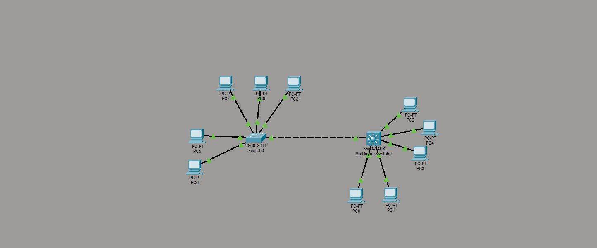

# Lab 01 - Inter-VLAN Routing with Layer 3 Switch

## Overview

Small LAN environment built in Cisco Packet Tracer to practice VLAN segmentation and communication between different VLANs using a Layer 3 switch.

## Technologies Used

- VLAN
- Access Ports
- Trunk Port
- Inter-VLAN Routing (SVI)
- PortFast
- BPDU Guard
- STP

## Topology

## Configuration Summary

- Created VLANs and assigned access ports.
- Configured trunk connection between switches.
- Enabled Inter-VLAN Routing using Layer 3 switch interfaces.
- Applied PortFast and BPDU Guard on access ports.

## Verification

The network was tested using:

- `show vlan brief`
- `show interfaces trunk`
- `show ip route`
- Ping tests between different VLANs.

## Files

- Packet Tracer project: `lab.pkt`
- Configuration screenshots
- Topology diagram
